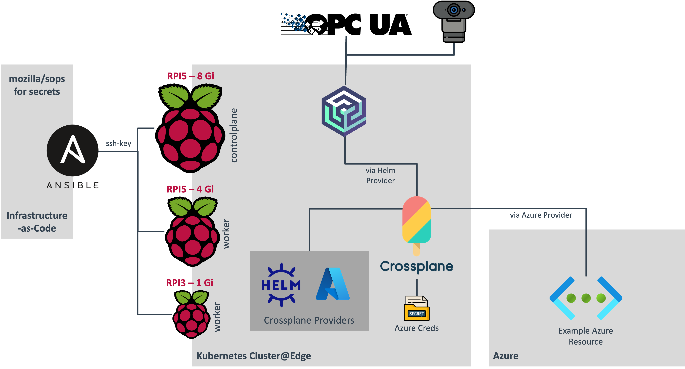

# Kubernetes at Edge

This repository is dedicated to a presentation delivered during ar Developer Day. The session, lasting 60 minutes, provides an introductory overview of Edge computing and Kubernetes, followed by a hands-on demonstration where a Kubernetes cluster is set up on three Raspberry Pi devices. This setup showcases an Infrastructure as Code (IaC) solution with Crossplane, illustrating its application by deploying an Azure resource directly from the cluster. Additionally, Azure Akri is utilized to manage a webcam attached to a cluster node. Key takeaways include:

- Demonstrating Kubernetes as an efficient and manageable solution for deploying and controlling workloads at the edge.
- Highlighting that running such a system does not require advanced hardware – it's achievable with Raspberry Pis, including a less powerful Raspberry Pi 3.
- Emphasizing that Edge computing need not be a stripped-down version of cloud infrastructure. It can process data locally or interact with cloud resources, as demonstrated with the Azure resource deployment.

The code found in this repo is complemented by a PowerPoint presentation, not included here due to privacy reasons of real-world show cases.

## Detailed Agenda

1. Introduction to Edge Computing
2. Understanding Kubernetes (K8s) and its benefits for Edge deployment
3. Step-by-step construction of a Kubernetes cluster:
    1. Initiating three bare Raspberry PIs
    2. Installing and configuring a 3-node Kubernetes cluster on these devices
    3. Implementing Crossplane as an alternative to Terraform for IaC
    4. Integrating Azure Akri for webcam functionality
    5. Deploying an Azure managed resource using Kubernetes
4. Open session for questions and discussion

## System Architecture

## Run this repo

The main aim of this repository is not to provide a running solution for your homelab, but rather to demonstrate the outlined use case. However to give a few pointers:

- ./scripts: Contains code to prepare the RPIs to be accessible by Ansible
- ./ansible: Ansible Playbook to build the Architecture step by step, e.g. you can run `ansible-playbook ./playbook/install_k8s.yml -i ./inventory.yml -t controlplane` to create a Controlplane
- ./k8s: Crossplane artifacts for Akri and Azure which can be deployed by `k apply -f file`
- ./artifacts: Contains created artifacts, e.g. the kubeconfig to connect to the cluster

Create a venv for Ansible in the folder ./ansible. Also you will find a `secrets.sops.yml` file, which contains important secrets. You can lookup the used keys there and create your own file using [SOPS](https://github.com/getsops/sops).
